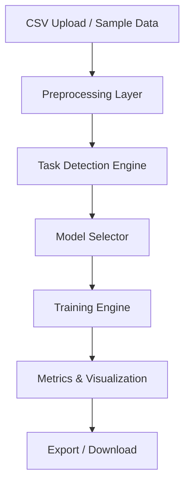
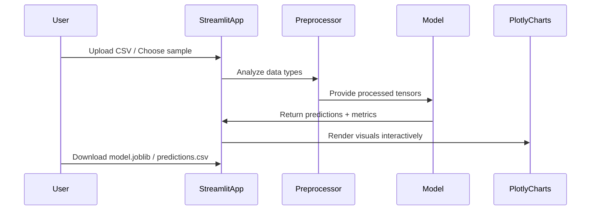

# ML Playground, Auto‑Detect, Clean & Future‑Proof

An interactive **Streamlit + Scikit‑Learn** web application that allows anyone to upload a dataset, automatically identify whether the problem is **classification** or **regression**, train multiple ML models interactively, visualize the results, and export the trained model, all from a single browser interface.

---

## Table of Contents
1. [Overview](#overview)
2. [Architecture](#architecture)
3. [Key Features](#key-features)
4. [Data Flow Diagram](#data-flow-diagram)
5. [Design Decisions](#design-decisions)
6. [Preprocessing Pipeline](#preprocessing-pipeline)
7. [Supported Models](#supported-models)
8. [Metrics Explained](#metrics-explained)
9. [User Guide](#user-guide)
10. [Deployment Guide](#deployment-guide)
11. [Troubleshooting](#troubleshooting)
12. [Performance Tips](#performance-tips)
13. [Roadmap](#roadmap)
14. [Author](#author)

---

## Overview

**ML Playground** provides a practical and educational environment for machine learning experimentation. It bridges the gap between Jupyter notebooks and full production pipelines, ideal for **data analysts, ML students, educators, and developers** who want to quickly prototype or demonstrate machine learning behavior on real data.

**Goals:**
- Automate tedious parts of ML workflow (data cleaning, encoding, scaling)
- Detect task type and prevent invalid configurations (e.g., classifier on continuous targets)
- Provide instant, intuitive visual feedback
- Ensure full forward and backward compatibility with future Streamlit and Scikit‑Learn versions

---

## Architecture

### System Flow


### Component Breakdown
| Component | Purpose |
|------------|----------|
| **Frontend (Streamlit)** | Renders user interface, handles file uploads, parameter selection, and visualization. |
| **Task Detection Engine** | Analyzes target column distribution to classify problem type (classification vs regression). |
| **Preprocessing Layer** | Builds ColumnTransformer with numeric scaling and categorical one-hot encoding. |
| **Training Engine** | Constructs scikit-learn Pipeline, trains model, evaluates metrics. |
| **Visualization Engine** | Uses Plotly for interactive confusion matrix, ROC, and residual plots. |
| **Export Layer** | Serializes the trained pipeline using Joblib for reuse in production scripts. |

---

## Key Features

### Auto Task Detection
Automatically determines if the target column represents a **classification** or **regression** task using data type and unique value heuristics.

### Model Management
Select from built‑in algorithms:
- **Classification:** Logistic Regression, Random Forest, XGBoost (optional)
- **Regression:** Linear Regression, Random Forest, XGBoost (optional)

### Visual Insights
- Real‑time metrics panel
- Confusion matrix & ROC for classification
- Residual and importance plots for regression

### Model Persistence
Save the full pipeline as `.joblib` for production deployment.

### Backward Compatible
Supports all versions of **scikit‑learn 0.24+** by auto‑detecting encoder parameters (`sparse_output` vs `sparse`).

---

## Data Flow Diagram



---

## Design Decisions

| Decision | Rationale |
|-----------|------------|
| **ColumnTransformer-based preprocessing** | Guarantees clean numeric and categorical handling without data leakage. |
| **Streamlit caching (`@st.cache_data`)** | Improves performance on repeated dataset loads. |
| **Pipeline encapsulation** | Ensures model reproducibility and allows joblib export. |
| **Responsive Plotly charts** | Future-proof visualization compatible with Streamlit 2025+. |
| **Auto-hyperparameter UI** | Simplifies model experimentation for non-programmers. |

---

## Preprocessing Pipeline

**Numeric features:**
- Standard scaling (zero mean, unit variance)

**Categorical features:**
- OneHotEncoder (`sparse_output` for sklearn ≥1.2 or `sparse=False` otherwise)

**Pipeline Example:**
```python
preprocess = ColumnTransformer(
    transformers=[
        ("num", StandardScaler(), numeric_features),
        ("cat", OneHotEncoder(handle_unknown="ignore"), categorical_features)
    ]
)
model = RandomForestClassifier()
pipe = Pipeline([("preprocess", preprocess), ("model", model)])
```

---

## Supported Models

### Classification
| Model | When to Use | Key Parameters |
|--------|--------------|----------------|
| Logistic Regression | Simple linear separable data | `C`, `max_iter` |
| RandomForestClassifier | Nonlinear problems, tabular data | `n_estimators`, `max_depth` |
| XGBClassifier | Large-scale data or high-dimensional | `learning_rate`, `n_estimators`, `max_depth` |

### Regression
| Model | When to Use | Key Parameters |
|--------|--------------|----------------|
| Linear Regression | Simple linear relationships | None |
| RandomForestRegressor | Nonlinear regression | `n_estimators`, `max_depth` |
| XGBRegressor | Complex relationships, feature interactions | `learning_rate`, `max_depth` |

---

## Metrics Explained

| Metric | Formula | Task | Interpretation |
|--------|----------|------|----------------|
| Accuracy | Correct / Total | Classification | Higher is better; best for balanced classes |
| F1 Score | 2 × (Precision × Recall) / (Precision + Recall) | Classification | Balances precision vs recall |
| ROC‑AUC | ∫TPR d(FPR) | Classification (binary) | Measures separability; 0.5 = random |
| R² | 1 - SSR/SST | Regression | Proportion of variance explained |
| MAE | Σ|y−ŷ| / n | Regression | Mean absolute deviation |
| RMSE | √(Σ(y−ŷ)²/n) | Regression | Penalizes large errors more |

---

## User Guide

### Load Data
Upload your CSV or use the built-in samples.

### Target Selection
Choose which column to predict, the system auto‑detects task type.

### Model Training
Click **Train Model**, adjust hyperparameters (if needed).

### Visualization
Interactive Plotly charts display metrics, confusion matrices, ROC, or residuals.

### Export
Download `model_pipeline.joblib` and `predictions.csv` for reuse.

---

## Deployment Guide

### Local Run
```bash
streamlit run app_streamlit_clean.py
```

### Streamlit Cloud
Push your repository to GitHub, then deploy via [share.streamlit.io](https://share.streamlit.io).

### Docker Deployment
```dockerfile
FROM python:3.10-slim
WORKDIR /app
COPY . .
RUN pip install -r requirements.txt
EXPOSE 8501
CMD ["streamlit", "run", "app_streamlit_clean.py", "--server.port=8501", "--server.address=0.0.0.0"]
```

### Hugging Face Spaces
- Select **Streamlit** template.
- Upload repository → done!

---

## Troubleshooting

| Issue | Cause | Solution |
|--------|--------|-----------|
| `OneHotEncoder got unexpected keyword 'sparse'` | scikit‑learn ≥1.2 uses `sparse_output` | Auto‑detected; upgrade sklearn if needed. |
| `Unknown label type: continuous` | Chose classifier for numeric target | Auto‑detect now prevents this. |
| `mean_squared_error got unexpected kw 'squared'` | sklearn <1.0 | Automatically handled. |
| `DeprecationWarning: use_container_width` | Streamlit 2025 update | Already replaced with width='stretch'. |

---

## Performance Tips

- For large CSVs, use preprocessed subsets.
- Use RandomForest for fast, robust tabular modeling.
- Enable XGBoost only if you have sufficient memory.
- Limit categorical cardinality to avoid excessive OHE expansion.

---

## Roadmap

- [ ] Add cross‑validation & Optuna tuning
- [ ] Integrate SHAP explainability
- [ ] Support time‑series & NLP preprocessing
- [ ] Multi‑page dashboards & reporting
- [ ] REST API for live predictions
- [ ] Continuous Integration with GitHub Actions
